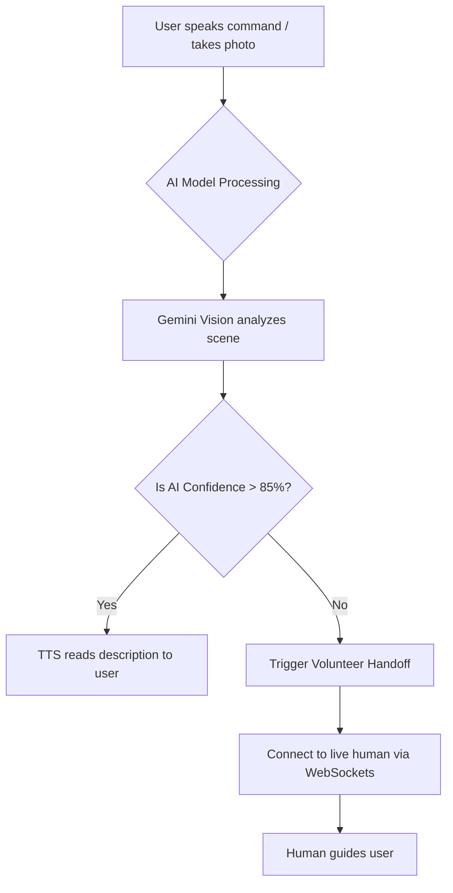

<div align="center">
  
# 👁️ VisionBridge

**An intelligent, accessibility-first AI companion designed to empower low-vision and blind users to navigate the physical world independently.**

[](https://reactjs.org/)
[](https://nodejs.org/)
[](https://www.mongodb.com/)
[](https://socket.io/)
[](https://deepmind.google/technologies/gemini/)
[]()

<br/>

> **"AI first. Human assistance when AI is uncertain."**

</div>

---

## 🌟 Overview

VisionBridge is a comprehensive, voice-first web application built on the MERN stack. It harnesses the power of **Google Gemini AI**, the **Web Speech API**, and **Real-Time Geolocation** to bridge the gap between low-vision users and their surroundings. 

Instead of relying on tiny text and complex menus, VisionBridge uses massive touch targets, extreme high-contrast colors, and continuous voice feedback to deliver an entirely seamless experience.

---

## 🎯 Project Highlights

- **📷 Camera-First Experience:** The world is your interface. Point your device to understand what is around you.
- **🗣️ Voice-First Interaction:** 100% hands-free navigation using natural language commands and spoken feedback.
- **🤝 Human-in-the-Loop AI:** The system gracefully falls back to human volunteers when the AI detects uncertainty.
- **♿ Accessibility-First Design:** Zero complex menus. Built exclusively with giant tap targets and ultra-high contrast colors.
- **⚙️ MERN Architecture:** Scalable, full-stack JavaScript environment using MongoDB, Express, React, and Node.js.
- **🧠 Gemini Vision Integration:** State-of-the-art multimodal AI for parsing environments, reading texts, and locating objects.

---

## 📸 Screenshots & Demo

*(Replace these placeholders with actual project screenshots or GIFs)*

| Home Dashboard (Voice UI) | AI Camera Assistant | Volunteer Tracking Radar |
| :---: | :---: | :---: |
| | |  |

---

## ✨ Key Features

### 🎙️ 1. Voice Command Navigation
The entire application can be navigated hands-free. A giant animated microphone on the homepage listens for natural language commands (e.g., *"Describe my surroundings"*, *"Find my wallet"*, *"Help me"*). The system intelligently maps spoken intent to the correct feature using the browser `SpeechRecognition` API.

### 📷 2. AI Camera Assistant
A practical, camera-first experience. By pointing their device's rear camera and tapping a giant capture button, users receive an instant auditory description of their surroundings. 

### ⚠️ 3. AI Hazard Prioritization
Safety is paramount. While using the camera, the app continuously scans the environment every few seconds in the background. It actively looks for immediate dangers like stairs, obstacles, or traffic, immediately interrupting other speech to shout a warning if a hazard is detected.

### 📖 4. Smart Reading Assistant
Point the camera at medicine labels, restaurant menus, or documents. VisionBridge captures the frame, extracts the text using intelligent OCR, and automatically reads the contents aloud.

### 🚌 5. Public Transport & Signboard Assistant
A specialized module tuned for traveling. It focuses exclusively on extracting bus numbers, train platform signs, and street navigation cues, parsing complex noisy imagery into reliable, structured travel data.

### 🔍 6. Smart Object Finder
Lost your keys? Ask the AI, *"Find my wallet"*. The AI scans the camera feed looking specifically for that object. If found, it will tell you exactly where it is relative to the camera (e.g., *"Your wallet is on the table, to your left"*).

### 📍 7. "Where Am I?" Location Assistant
Replaces complex visual maps with simple, auditory geographical awareness. Using geolocation and OpenStreetMap data, it translates coordinates into natural language context: *"You are near the City Library."*

### 🧠 8. AI Confidence Detection & Volunteer Handoff
Artificial Intelligence is not always correct. VisionBridge analyzes Gemini's confidence scores on every request. If the AI is uncertain (confidence < 0.85), it refuses to guess and seamlessly transitions the user to a real human volunteer to prevent hallucinations.

### 🤝 9. Volunteer Help Network
When AI isn't enough, humans step in. Users can broadcast a help request to nearby registered volunteers. 
- **Real-Time Tracking:** Live interactive radar maps powered by `Socket.io`.
- **Instant Connections:** Volunteers can view the user's live camera feed and GPS location to guide them safely.

### 🚨 10. Emergency SOS
Speed and reliability for critical moments. Shouting *"Emergency"* or *"SOS"* starts a 5-second countdown. It automatically sends live GPS tracking links and distress messages to pre-configured trusted contacts.

---

## ⚙️ Architecture & AI Workflow

### The "Human-in-the-Loop" Workflow



### ♿ Accessibility Highlights
- **Fluid Typography:** Fonts scale automatically based on the device width, ensuring text is never too small.
- **High Contrast:** Colors strictly follow WCAG AAA guidelines for maximum legibility.
- **Screen Reader Friendly:** All elements possess descriptive `aria-labels` and semantic HTML tags.

---

## 🛠️ Tech Stack

| Domain | Technologies Used |
| :--- | :--- |
| **Frontend** | React.js (v18), React Router, Vanilla CSS |
| **Backend** | Node.js, Express.js |
| **Database** | MongoDB, Mongoose ODM |
| **Real-Time Data** | Socket.io |
| **Artificial Intelligence** | Google Gemini 2.5 Flash / Pro (`@google/generative-ai`) |
| **Browser APIs** | `SpeechRecognition`, `SpeechSynthesis`, `getUserMedia`, `Geolocation` |
| **Maps & Routing** | OpenStreetMap, Nominatim (Geocoding) |

---

## 📂 Folder Structure

```text
visionbridge/
├── client/                     # React Frontend
│   ├── public/
│   └── src/
│       ├── components/         # Reusable UI (Voice Navigation, Live Camera)
│       ├── modules/            # Feature logic (AIAssistant, Finder, Transport, SOS, Volunteer)
│       ├── pages/              # Main routing pages (Home)
│       └── services/           # API integrations (visionService, transportService, etc.)
├── server/                     # Node.js Backend
│   ├── controllers/            # Route logic (visionController, readingController, etc.)
│   ├── middleware/             # Rate limiters & request sanitization
│   ├── models/                 # Mongoose schemas (Volunteer, SOS)
│   ├── routes/                 # Express API routes
│   └── server.js               # Express app entry & Socket.io setup
└── README.md
```

---

## 🚀 Getting Started

### Prerequisites
- [Node.js](https://nodejs.org/en/) (v16 or higher)
- [MongoDB](https://www.mongodb.com/) (Local instance or MongoDB Atlas)
- [Google Gemini API Key](https://aistudio.google.com/apikey) (Free tier is sufficient)

### 1. Clone the Repository
```bash
git clone https://github.com/yourusername/visionbridge.git
cd visionbridge
```

### 2. Backend Setup
```bash
cd server
npm install
```
Create a `.env` file in the `server` directory:
```env
PORT=5000
MONGODB_URI=mongodb://127.0.0.1:27017/visionbridge
GEMINI_API_KEY=your_google_gemini_api_key_here
```
Start the backend server:
```bash
npm run dev
```

### 3. Frontend Setup
Open a new terminal window:
```bash
cd client
npm install
```
Start the React development server:
```bash
npm start
```
*Note: The frontend runs on `http://localhost:3000` and proxies API requests to `http://localhost:5000`.*

---

## 📱 Usage & Testing Tips
- **Microphone & Camera Permissions:** Because VisionBridge heavily relies on hardware APIs (`getUserMedia`, `SpeechRecognition`), you **must** run the app on `localhost` or serve it over a secure `https://` connection.
- **Desktop Testing:** Use the "Upload from Device" fallback buttons inside the camera modules if your desktop lacks a webcam.
- **Voice Navigation:** Click the large central mic button on the home page and speak *"Describe surroundings"* to see the routing engine in action.

---

## 🔮 Future Scope
- **Offline Mode:** Integrating lightweight ONNX computer vision models to provide basic hazard detection when the internet is unavailable.
- **Wearable Integration:** Connecting the system to smart glasses (like Ray-Ban Meta) for a completely hands-free experience.
- **Advanced NLP:** Replacing the basic regex voice parsing with a localized LLM to understand highly complex user commands.

---

## 🤝 Contributing
Contributions are highly welcome! Whether it's improving accessibility patterns, adding new languages for Speech Synthesis, or optimizing the Gemini prompts—please feel free to submit a Pull Request.

1. **Fork the Project**
2. **Create your Feature Branch** (`git checkout -b feature/AmazingFeature`)
3. **Commit your Changes** (`git commit -m 'Add some AmazingFeature'`)
4. **Push to the Branch** (`git push origin feature/AmazingFeature`)
5. **Open a Pull Request**

---

## 📄 License
Distributed under the MIT License. See `LICENSE` for more information.

---

<div align="center">
  <b>Built with ❤️ to make the world more accessible for everyone.</b>
</div>
